# Image Usage Flowchart (Website → Static Images)

This document maps each key page/template to the static images it references, to help confirm alignment with the external "images 3.0" set.

## Mermaid Overview

```mermaid
graph LR
    Base[base.html] --> static/images/Penasia-Logo.PNG
    Certificates[certificates/view.html] --> static/images/penasia-logo.png

    Index[index.html] --> static/images/university/campus-exterior-01.jpg
    Index --> static/images/about/about_01.jpg
    Index --> static/images/courses/courses_01.jpg
    Index --> static/images/university/classroom-02.jpg
    Index --> static/images/courses/courses_03.jpg
    Index --> static/images/about/about_02.jpg
    Index --> static/images/testimonials/testimonials_01.jpg
    Index --> static/images/testimonials/testimonials_02.jpg
    Index --> static/images/testimonials/testimonials_03.jpg

    About[about.html] --> static/images/about/about-us-hero.png
    About --> static/images/about/about_02.jpg

    Courses[courses.html] --> static/images/courses/courses_01.jpg
    Courses --> static/images/university/classroom-02.jpg
    Courses --> static/images/courses/courses_03.jpg

    CourseDetail[course_detail.html] --> static/images/courses/courses_01.jpg
    CourseDetail --> static/images/university/classroom-02.jpg
    CourseDetail --> static/images/courses/courses_03.jpg

    CourseDetailPremium[course_detail_premium.html] --> static/images/courses/courses_01.jpg

    Facilities[facilities.html] --> static/images/university/campus-exterior-03.jpg
    Facilities --> static/images/university/classroom-01.jpg
    Facilities --> static/images/university/facility-01.jpg
    Facilities --> static/images/university/smart-class-room.png
    Facilities --> static/images/university/facility-03.jpg
    Facilities --> static/images/facilities/facility-01.png
    Facilities --> static/images/facilities/facility-02.png
    Facilities --> static/images/university/campus-exterior-03.jpg

    Faculty[faculty.html] --> static/images/faculty/faculty_01.jpg
    Faculty --> static/images/faculty/faculty_02.jpg
    Faculty --> static/images/faculty/faculty_03.jpg
    Faculty --> static/images/faculty/faculty_04.jpg
    Faculty --> static/images/faculty/faculty_05.jpg
    Faculty --> static/images/faculty/faculty_06.jpg
    Faculty --> static/images/faculty/faculty_07.jpg
    Faculty --> static/images/faculty/faculty_08.jpg

    FacultyOld[faculty_old.html] --> static/images/faculty/faculty_01.jpg
    FacultyOld --> static/images/faculty/faculty_02.jpg
    FacultyOld --> static/images/faculty/faculty_03.jpg
    FacultyOld --> static/images/faculty/faculty_04.jpg
    FacultyOld --> static/images/faculty/faculty_05.jpg
    FacultyOld --> static/images/faculty/faculty_06.jpg
    FacultyOld --> static/images/faculty/faculty_07.jpg
    FacultyOld --> static/images/faculty/faculty_08.jpg
    FacultyOld --> static/images/testimonials/testimonials_01.jpg
    FacultyOld --> static/images/testimonials/testimonials_02.jpg
    FacultyOld --> static/images/testimonials/testimonials_03.jpg

    News[news.html] --> static/images/hero/hero_01.jpg
    News --> static/images/courses/courses_01.jpg
    News --> static/images/facilities/facilities_01.jpg
    News --> static/images/testimonials/testimonials_01.jpg
    News --> static/images/about/about_02.jpg
    News --> static/images/hero/hero_02.jpg

    StudentLife[student_life.html] --> static/images/university/student-life-01.jpg
    StudentLife --> static/images/testimonials/testimonials_01.jpg
    StudentLife --> static/images/testimonials/testimonials_02.jpg
    StudentLife --> static/images/testimonials/testimonials_03.jpg
    StudentLife --> static/images/university/student-life-02.jpg
    StudentLife --> static/images/university/student-life-03.jpg
```


## Page → Image References
- base.html: `images/Penasia-Logo.PNG`
- certificates/view.html: `images/penasia-logo.png`
- index.html: `images/university/campus-exterior-01.jpg`, `images/about/about_01.jpg`, `images/courses/courses_01.jpg`, `images/university/classroom-02.jpg`, `images/courses/courses_03.jpg`, `images/about/about_02.jpg`, `images/testimonials/testimonials_01.jpg`, `images/testimonials/testimonials_02.jpg`, `images/testimonials/testimonials_03.jpg`
- about.html: `images/about/about-us-hero.png`, `images/about/about_02.jpg`
- courses.html: `images/courses/courses_01.jpg`, `images/university/classroom-02.jpg`, `images/courses/courses_03.jpg`
- course_detail.html: `images/courses/courses_01.jpg`, `images/university/classroom-02.jpg`, `images/courses/courses_03.jpg`
- course_detail_premium.html: `images/courses/courses_01.jpg`
- facilities.html: `images/university/campus-exterior-03.jpg`, `images/university/classroom-01.jpg`, `images/university/facility-01.jpg`, `images/university/smart-class-room.png`, `images/university/facility-03.jpg`, `images/facilities/facility-01.png`, `images/facilities/facility-02.png`, `images/university/campus-exterior-03.jpg`
- faculty.html: `images/faculty/faculty_01.jpg` ... `images/faculty/faculty_08.jpg`
- faculty_old.html: `images/faculty/faculty_01.jpg` ... `images/faculty/faculty_08.jpg`, `images/testimonials/testimonials_01.jpg`, `images/testimonials/testimonials_02.jpg`, `images/testimonials/testimonials_03.jpg`
- news.html: `images/hero/hero_01.jpg`, `images/courses/courses_01.jpg`, `images/facilities/facilities_01.jpg`, `images/testimonials/testimonials_01.jpg`, `images/about/about_02.jpg`, `images/hero/hero_02.jpg`
- student_life.html: `images/university/student-life-01.jpg`, `images/testimonials/testimonials_01.jpg`, `images/testimonials/testimonials_02.jpg`, `images/testimonials/testimonials_03.jpg`, `images/university/student-life-02.jpg`, `images/university/student-life-03.jpg`

## Next: Confirm "images 3.0" Coverage
- Compare each listed static image with the external "images 3.0" set.
- Mark images that are sourced from 3.0 and note any missing ones.
- If helpful, provide the 3.0 folder manifest (filenames + paths) or add it to the workspace so this doc can auto-annotate provenance.


## Images 3.0 → Pages Mapping (Auto-generated)

```mermaid
graph LR
    index_html[index.html]
    about_html[about.html]
    courses_html[courses.html]
    course_detail_html[course_detail.html]
    course_detail_premium_html[course_detail_premium.html]
    student_life_html[student_life.html]
    facilities_html[facilities.html]
    _extras_[(extras)]
    1_1__Home_page__PNG_1__Home[1. Home: 1.1 (Home page).PNG]
    index_html --> 1_1__Home_page__PNG_1__Home
    1_2__About_university_of_penasia__png_1__Home[1. Home: 1.2 (About university of penasia).png]
    index_html --> 1_2__About_university_of_penasia__png_1__Home
    1_3__Hotel_culinary_management_diploma___png_1__Home[1. Home: 1.3 (Hotel culinary management diploma ).png]
    index_html --> 1_3__Hotel_culinary_management_diploma___png_1__Home
    1_4__BTEC_Business_Management_HND__png_1__Home[1. Home: 1.4 (BTEC Business Management HND).png]
    index_html --> 1_4__BTEC_Business_Management_HND__png_1__Home
    1_5__Western_Bakery_and_Pastery__PNG_1__Home[1. Home: 1.5 (Western Bakery and Pastery).PNG]
    index_html --> 1_5__Western_Bakery_and_Pastery__PNG_1__Home
    1_6__Western_cuisine_ceritficate__png_1__Home[1. Home: 1.6 (Western cuisine ceritficate).png]
    index_html --> 1_6__Western_cuisine_ceritficate__png_1__Home
    1_7__Why_choose_penasia__png_1__Home[1. Home: 1.7 (Why choose penasia).png]
    index_html --> 1_7__Why_choose_penasia__png_1__Home
    2_1_PNG_2__About_us[2. About us: 2.1.PNG]
    about_html --> 2_1_PNG_2__About_us
    2_2_png_2__About_us[2. About us: 2.2.png]
    about_html --> 2_2_png_2__About_us
    3_1_png_3__Programs[3. Programs: 3.1.png]
    courses_html --> 3_1_png_3__Programs
    course_detail_html --> 3_1_png_3__Programs
    course_detail_premium_html --> 3_1_png_3__Programs
    3_2_png_3__Programs[3. Programs: 3.2.png]
    courses_html --> 3_2_png_3__Programs
    course_detail_html --> 3_2_png_3__Programs
    course_detail_premium_html --> 3_2_png_3__Programs
    5_1_png_5__Student_life[5. Student life: 5.1.png]
    student_life_html --> 5_1_png_5__Student_life
    5_2__State_of_the_art_facilities__png_5__Student_life[5. Student life: 5.2 (State of the art facilities).png]
    student_life_html --> 5_2__State_of_the_art_facilities__png_5__Student_life
    5_3__Collaborative_spaces__png_5__Student_life[5. Student life: 5.3 (Collaborative spaces).png]
    student_life_html --> 5_3__Collaborative_spaces__png_5__Student_life
    Lisa_jpg_5__Student_life[5. Student life: Lisa.jpg]
    student_life_html --> Lisa_jpg_5__Student_life
    Michael_Wong_jpg_5__Student_life[5. Student life: Michael Wong.jpg]
    student_life_html --> Michael_Wong_jpg_5__Student_life
    Sarah_Chen_jpg_5__Student_life[5. Student life: Sarah Chen.jpg]
    student_life_html --> Sarah_Chen_jpg_5__Student_life
    6_1__World_class_learning_environment__png_6__Facilities[6. Facilities: 6.1 (World class learning environment).png]
    facilities_html --> 6_1__World_class_learning_environment__png_6__Facilities
    6_2__Professional_training_kitchen__png_6__Facilities[6. Facilities: 6.2 (Professional training kitchen).png]
    facilities_html --> 6_2__Professional_training_kitchen__png_6__Facilities
    6_3__Specialized_pastry_kitchen__png_6__Facilities[6. Facilities: 6.3 (Specialized pastry kitchen).png]
    facilities_html --> 6_3__Specialized_pastry_kitchen__png_6__Facilities
    6_4__Smart_class_room__png_6__Facilities[6. Facilities: 6.4 (Smart class room).png]
    facilities_html --> 6_4__Smart_class_room__png_6__Facilities
    6_5__Learning_resource_centre__png_6__Facilities[6. Facilities: 6.5 (Learning resource centre).png]
    facilities_html --> 6_5__Learning_resource_centre__png_6__Facilities
    Gemini_Generated_Image_cd4367cd4367cd43_png_Extras[Extras: Gemini_Generated_Image_cd4367cd4367cd43.png]
    _extras_ --> Gemini_Generated_Image_cd4367cd4367cd43_png_Extras
    Gemini_Generated_Image_ke6qtake6qtake6q_png_Extras[Extras: Gemini_Generated_Image_ke6qtake6qtake6q.png]
    _extras_ --> Gemini_Generated_Image_ke6qtake6qtake6q_png_Extras
    IMG_5026_PNG_Extras[Extras: IMG_5026.PNG]
    _extras_ --> IMG_5026_PNG_Extras
    Learning_Resource_Center__1__png_Extras[Extras: Learning Resource Center (1).png]
    _extras_ --> Learning_Resource_Center__1__png_Extras
    Learning_Resource_Center__2__png_Extras[Extras: Learning Resource Center (2).png]
    _extras_ --> Learning_Resource_Center__2__png_Extras
    Learning_Resource_Center__3__png_Extras[Extras: Learning Resource Center (3).png]
    _extras_ --> Learning_Resource_Center__3__png_Extras
    Modern_KitchenLab__1__png_Extras[Extras: Modern KitchenLab (1).png]
    _extras_ --> Modern_KitchenLab__1__png_Extras
    Workshop__Practical_Session_png_Extras[Extras: Workshop  Practical Session.png]
    _extras_ --> Workshop__Practical_Session_png_Extras
    collabrative_space_2___2__png_Extras[Extras: collabrative space 2  (2).png]
    _extras_ --> collabrative_space_2___2__png_Extras
    kitchen_training___3__png_Extras[Extras: kitchen training  (3).png]
    _extras_ --> kitchen_training___3__png_Extras
    kitchen_training___4__png_Extras[Extras: kitchen training  (4).png]
    _extras_ --> kitchen_training___4__png_Extras
    student_life_1_image_png_Extras[Extras: student life 1 image.png]
    _extras_ --> student_life_1_image_png_Extras
``

- 1. Home → index.html
  - /home/imjd/Hong Kong University/assets/images 3.0/1. Home/1.1 (Home page).PNG
  - /home/imjd/Hong Kong University/assets/images 3.0/1. Home/1.2 (About university of penasia).png
  - /home/imjd/Hong Kong University/assets/images 3.0/1. Home/1.3 (Hotel culinary management diploma ).png
  - /home/imjd/Hong Kong University/assets/images 3.0/1. Home/1.4 (BTEC Business Management HND).png
  - /home/imjd/Hong Kong University/assets/images 3.0/1. Home/1.5 (Western Bakery and Pastery).PNG
  - /home/imjd/Hong Kong University/assets/images 3.0/1. Home/1.6 (Western cuisine ceritficate).png
  - /home/imjd/Hong Kong University/assets/images 3.0/1. Home/1.7 (Why choose penasia).png
- 2. About us → about.html
  - /home/imjd/Hong Kong University/assets/images 3.0/2. About us/2.1.PNG
  - /home/imjd/Hong Kong University/assets/images 3.0/2. About us/2.2.png
- 3. Programs → courses.html, course_detail.html, course_detail_premium.html
  - /home/imjd/Hong Kong University/assets/images 3.0/3. Programs/3.1.png
  - /home/imjd/Hong Kong University/assets/images 3.0/3. Programs/3.2.png
- 5. Student life → student_life.html
  - /home/imjd/Hong Kong University/assets/images 3.0/5. Student life/5.1.png
  - /home/imjd/Hong Kong University/assets/images 3.0/5. Student life/5.2 (State of the art facilities).png
  - /home/imjd/Hong Kong University/assets/images 3.0/5. Student life/5.3 (Collaborative spaces).png
  - /home/imjd/Hong Kong University/assets/images 3.0/5. Student life/Chefs/Lisa.jpg
  - /home/imjd/Hong Kong University/assets/images 3.0/5. Student life/Chefs/Michael Wong.jpg
  - /home/imjd/Hong Kong University/assets/images 3.0/5. Student life/Chefs/Sarah Chen.jpg
- 6. Facilities → facilities.html
  - /home/imjd/Hong Kong University/assets/images 3.0/6. Facilities/6.1 (World class learning environment).png
  - /home/imjd/Hong Kong University/assets/images 3.0/6. Facilities/6.2 (Professional training kitchen).png
  - /home/imjd/Hong Kong University/assets/images 3.0/6. Facilities/6.3 (Specialized pastry kitchen).png
  - /home/imjd/Hong Kong University/assets/images 3.0/6. Facilities/6.4 (Smart class room).png
  - /home/imjd/Hong Kong University/assets/images 3.0/6. Facilities/6.5 (Learning resource centre).png
- Extras → (extras)
  - /home/imjd/Hong Kong University/assets/images 3.0/Extras/Gemini_Generated_Image_cd4367cd4367cd43.png
  - /home/imjd/Hong Kong University/assets/images 3.0/Extras/Gemini_Generated_Image_ke6qtake6qtake6q.png
  - /home/imjd/Hong Kong University/assets/images 3.0/Extras/IMG_5026.PNG
  - /home/imjd/Hong Kong University/assets/images 3.0/Extras/Learning Resource Center (1).png
  - /home/imjd/Hong Kong University/assets/images 3.0/Extras/Learning Resource Center (2).png
  - /home/imjd/Hong Kong University/assets/images 3.0/Extras/Learning Resource Center (3).png
  - /home/imjd/Hong Kong University/assets/images 3.0/Extras/Modern KitchenLab (1).png
  - /home/imjd/Hong Kong University/assets/images 3.0/Extras/Workshop  Practical Session.png
  - /home/imjd/Hong Kong University/assets/images 3.0/Extras/collabrative space 2  (2).png
  - /home/imjd/Hong Kong University/assets/images 3.0/Extras/kitchen training  (3).png
  - /home/imjd/Hong Kong University/assets/images 3.0/Extras/kitchen training  (4).png
  - /home/imjd/Hong Kong University/assets/images 3.0/Extras/student life 1 image.png


## Coverage Summary (Images 3.0)

- Proposed replacements: 22
- Gaps: 43
- Details: see IMAGES3_REPLACEMENT_PLAN.md for per-image mapping

### Sample Proposed (top 10)

- - about.html: images/about/about-us-hero.png → /home/imjd/Hong Kong University/assets/images 3.0/2. About us/2.1.PNG (confidence=5, status=proposed)
- - about.html: images/about/about_02.jpg → /home/imjd/Hong Kong University/assets/images 3.0/2. About us/2.2.png (confidence=5, status=proposed)
- - course_detail.html: images/courses/courses_01.jpg → /home/imjd/Hong Kong University/assets/images 3.0/3. Programs/3.1.png (confidence=5, status=proposed)
- - course_detail.html: images/courses/courses_01.jpg → /home/imjd/Hong Kong University/assets/images 3.0/3. Programs/3.1.png (confidence=5, status=proposed)
- - course_detail.html: images/courses/courses_03.jpg → /home/imjd/Hong Kong University/assets/images 3.0/3. Programs/3.2.png (confidence=5, status=proposed)
- - course_detail_premium.html: images/courses/courses_01.jpg → /home/imjd/Hong Kong University/assets/images 3.0/3. Programs/3.1.png (confidence=5, status=proposed)
- - courses.html: images/courses/courses_01.jpg → /home/imjd/Hong Kong University/assets/images 3.0/3. Programs/3.1.png (confidence=5, status=proposed)
- - courses.html: images/courses/courses_01.jpg → /home/imjd/Hong Kong University/assets/images 3.0/3. Programs/3.1.png (confidence=5, status=proposed)
- - courses.html: images/courses/courses_01.jpg → /home/imjd/Hong Kong University/assets/images 3.0/3. Programs/3.1.png (confidence=5, status=proposed)
- - courses.html: images/courses/courses_03.jpg → /home/imjd/Hong Kong University/assets/images 3.0/3. Programs/3.2.png (confidence=5, status=proposed)

### Sample Gaps (top 10)

- - base.html: images/Penasia-Logo.PNG → /home/imjd/Hong Kong University/assets/images 3.0/1. Home/1.7 (Why choose penasia).png (confidence=1, status=gap)
- - certificates/view.html: images/penasia-logo.png → /home/imjd/Hong Kong University/assets/images 3.0/1. Home/1.7 (Why choose penasia).png (confidence=1, status=gap)
- - course_detail.html: images/university/classroom-02.jpg → /home/imjd/Hong Kong University/assets/images 3.0/3. Programs/3.2.png (confidence=0, status=gap)
- - courses.html: images/university/classroom-02.jpg → /home/imjd/Hong Kong University/assets/images 3.0/3. Programs/3.2.png (confidence=0, status=gap)
- - facilities.html: images/facilities/facility-02.png → /home/imjd/Hong Kong University/assets/images 3.0/6. Facilities/6.5 (Learning resource centre).png (confidence=0, status=gap)
- - facilities.html: images/university/campus-exterior-03.jpg → /home/imjd/Hong Kong University/assets/images 3.0/6. Facilities/6.5 (Learning resource centre).png (confidence=0, status=gap)
- - facilities.html: images/university/campus-exterior-03.jpg → /home/imjd/Hong Kong University/assets/images 3.0/6. Facilities/6.5 (Learning resource centre).png (confidence=0, status=gap)
- - faculty.html: images/faculty/faculty_01.jpg → /home/imjd/Hong Kong University/assets/images 3.0/Extras/student life 1 image.png (confidence=0, status=gap)
- - faculty.html: images/faculty/faculty_02.jpg → /home/imjd/Hong Kong University/assets/images 3.0/Extras/IMG_5026.PNG (confidence=2, status=gap)
- - faculty.html: images/faculty/faculty_03.jpg → /home/imjd/Hong Kong University/assets/images 3.0/Extras/student life 1 image.png (confidence=0, status=gap)
